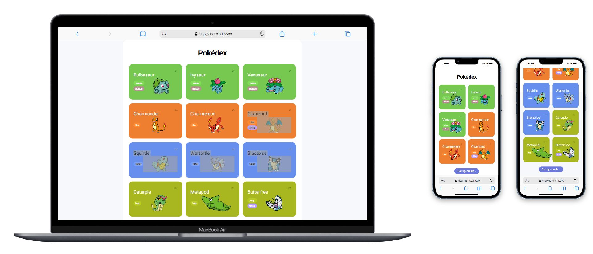

# ⚡ Projeto
## 🚀 Bem-vindo ao projeto PokeApi feito em Javascript Vanilla! 
### Este é um projeto consome os dados de uma API. 
## Pré-requisitos

Ter a extensão Live Server instalado no Visual Studio Code

- Clica com o botão direito do mouse em cima do arquivo index.html
- Escolha a opção Open Width Live Server para subir a aplicação no localhost
- E Pronto! 

 